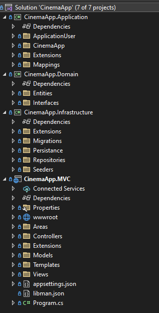

# CinemaApp

## Description

### General structure
CinemaApp is an IT system for the cinemas that uses hardware tickets in the form of RFID cards. This system consists of two parts:
    - Web Application
    - A physical device along with the software to operate it

 

### Web Application
#### Structure
Full-stack application built using .NET Core 7.0, Entity Framework Core, Identity and Microsoft SQL Server for the backend part. HTML/CSS, Bootstrap 5 and JavaScript were used to create the frontend part.
The application was created in accordance with Clean Architecture. Division of application layers:

 

 

The following patterns were also used to build the application:
    - CQRS
    - Mediator
    - MVC
    - Dependency injection
    - Builder

The database was created using Microsoft SQL Server. Database schema:

 

### Physical device
The physical device used by the IT system is a ticket scanner in the form of RFID tags. The following were used for its construction:
    - Arduino Uno R4 WiFi
    - RFID-RC522
    - 4-channel logic level converter
    - 2 x LED
    - 2 x 330R resistor

Diagram of the construction of a physical device:

 

## Operation of the IT system
> [!IMPORTANT]
> For the system to function properly, it is required to create a publication of the MVC layer of the web application on the IIS server and to set the appropriate server data in the Arduino code configuration files. The server and the physical device should be connected to one network.

Presentation of the operation of the web application

 
